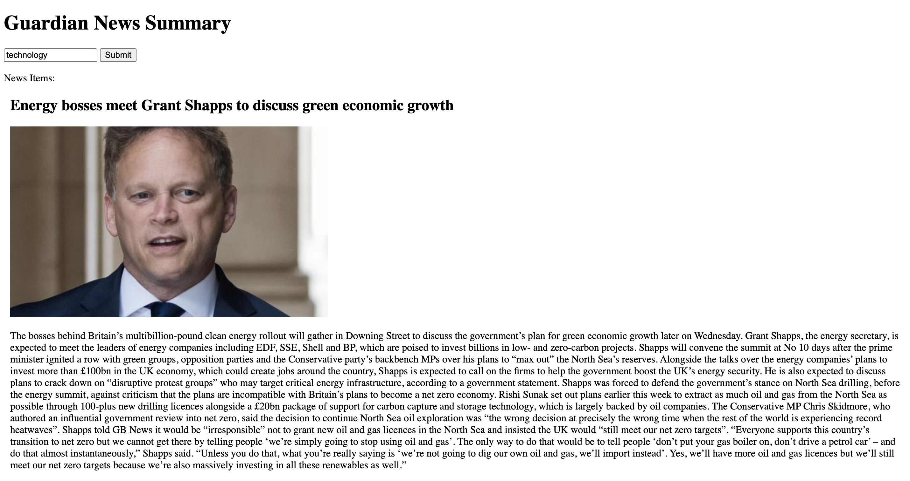
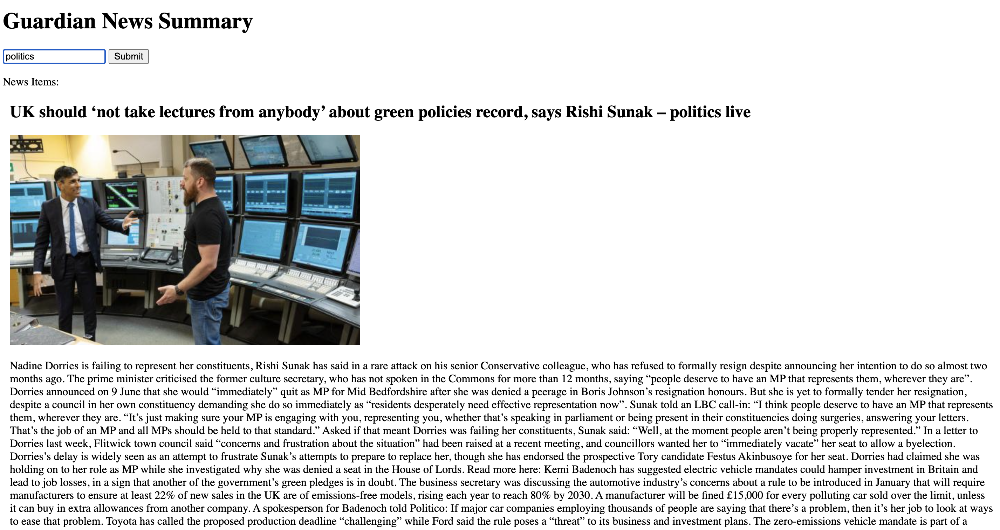

# Guardian Api Challenge

This is a challenge task provided by Makers Bootcamp

Task:
You'll create a single page web app written in JavaScript, CSS and HTML that grabs all the headlines from the Guardian newspaper API and displays them on a page. You can search for specific subjects, eg. 'Politics' and the results will be filtered.

## Technologies

 * Jest to write your tests with unit and integration tests
 * The [`jest-fetch-mock`](https://www.npmjs.com/package/jest-fetch-mock) module (or
   similar) to mock `fetch` requests (so you don't request the API when running tests!)
 * A build tool such as `esbuild` to bundle files together

## Setup

Before running the application, make sure you have the following installed on your machine:

Node.js (v14 or higher)
npm (Node Package Manager) or yarn

## Running the app

1. Clone this repository to your local machine:

```bash
git clone <repository_url>
cd news-summary-challenge
```

2. Install dependencies:
```bash
npm install
```

## Usage

To start the aplication simply run the html file in your browser

--------------------------------------------------------------------
See these screenshots for a demonstration:




